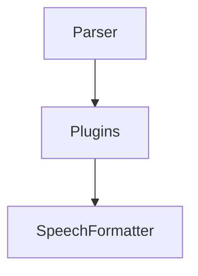
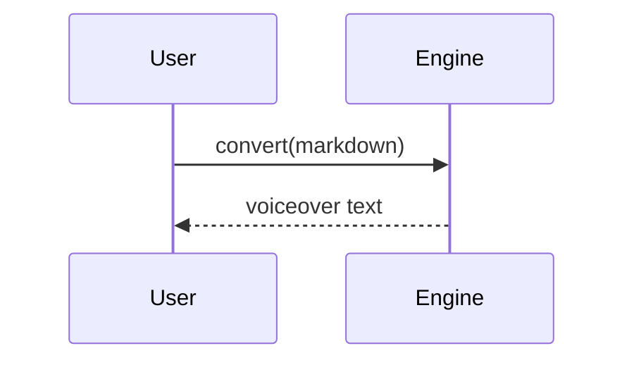
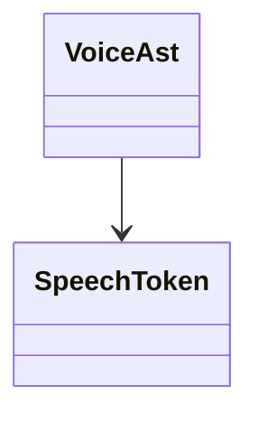

# Mermaid Diagram Fixture

## Flowchart

```mermaid
graph TD
  A[Parser] --> B[Plugins]
  B --> C[SpeechFormatter]
```

## Sequence

```mermaid
sequenceDiagram
  participant User
  participant Engine
  User->>Engine: convert(markdown)
  Engine-->>User: voiceover text
```

## Class

```mermaid
classDiagram
  class VoiceAst
  class SpeechToken
  VoiceAst --> SpeechToken
```
