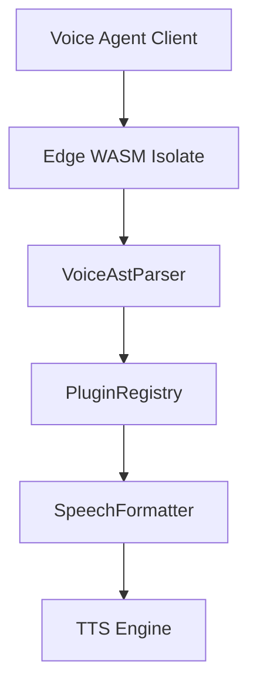
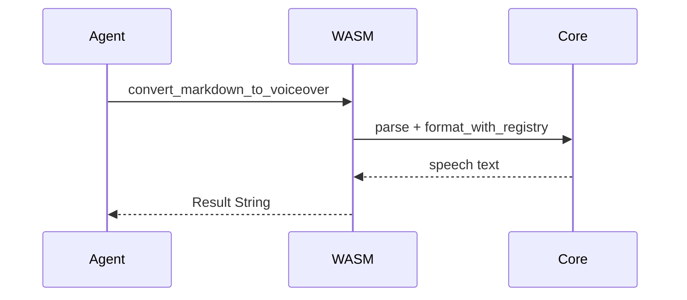
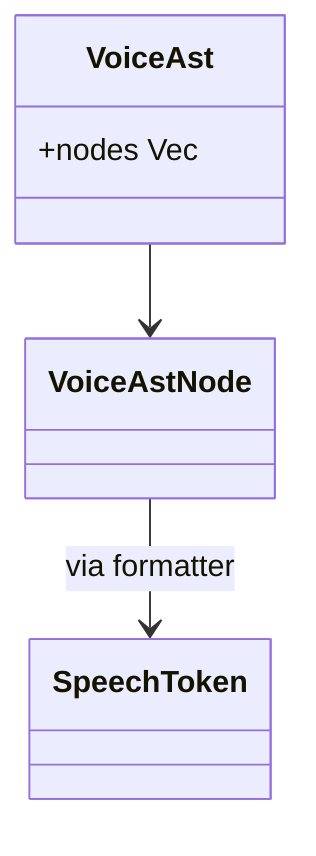
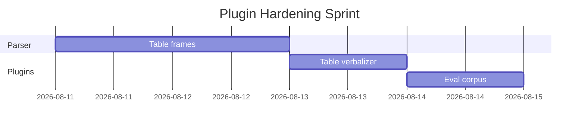

# Platform Topology Narrated Through Mermaid

Architecture diagrams are useless to voice agents unless Mermaid fences become short spoken overviews. This document mixes several diagram kinds that the Mermaid plugin must classify.

## Request Path

## Session Handshake

## Domain Model

## Timeline

Judges should hear flowchart, sequence, class, and Gantt summaries rather than raw Mermaid keywords read character by character.
