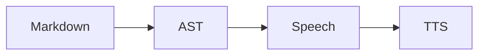

# Mixed-Domain Handbook for Voice Agent Demos

Demo scripts need a single Markdown document that exercises every plugin in one pass. This handbook is that document and exceeds one thousand characters on purpose.

## Opening Narrative

Welcome to the mjx-md-voiceover capability demo. We will convert documentation that looks noisy to TTS engines and produce conversational speech text instead.

## Code Path

```go
package main
import "fmt"
func main() {
  fmt.Println("voiceover demo")
}
```

## Math Path

Consider $\frac{1}{2}mv^2$ beside the identity $a^2 + b^2 = c^2$.

$$
\sqrt{x^2 + y^2}
$$

## Diagram Path



## Callout Path

> [!NOTE]
> This demo document is part of the twenty-file capability corpus.

## Table Path

| Domain | Plugin | Expected Cue |
| --- | --- | --- |
| code | CodeBlockPlugin | Code snippet in Go |
| math | LatexMathPlugin | squared / fraction |
| diagram | MermaidPlugin | flowchart diagram |
| callout | AdmonitionPlugin | Note callout |
| table | TablePlugin | Table with columns |

If any path fails, the demo script should stop and file a Plane ticket under AIPLUG rather than improvising speech rules in the application layer.
